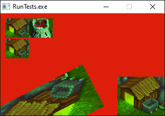

# Allegro 5 bindings for Oberon



*Read in Russian below*

Allegro5 is a cross-paltform graphics library. It supports GPU-based drawing.

Oberon is the most simple yet very powerful general-purpose programming language.

## Compiler

You will need
[Free Oberon Compiler](https://github.com/oberoncompiler/foc)
to compile the library binding and the tests.

## Building

1. Install [Free Oberon Compiler](https://github.com/oberoncompiler/foc)
and add the directory containing `foc` exectuable to your `PATH`
environment variable (or run `foc` executable directly, using full path).

2. Download and unpack this repo.

3. Go to the this repo's directory (containing `RunTests.Mod`) and run:
```
foc RunTests
```

A file `RunTests.exe` will be created. Run it.

## Linux

On Linux (Debian) run as root:
```
dpkg --add-architecture i386
apt-get update
apt-get install libxpm4:i386 libgl1-mesa-glx:i386
```

SO-files are used instead of the DLL-files.
Please edit the first lines of `Allegro5/Mod/Lib.Mod` and
`Allegro5/Mod/Image.Mod` replacing:

* `"allegro-5.2.dll"` with `"liballegro.so.5.2"`
* `"allegro_image-5.2.dll"` with `"liballegro_image.so.5.2"`

To run the program, set `LD_LIBARY_PATH=.` or install
32-bit versions of Allegro5 libraries.
```
LD_LIBRARY_PATH=. ./RunTests
```

_________________________________________________

# Привязка Аллегро-5 для Оберона

Аллегро-5 — это кроссплатформенная графическая библиотека. Она поддерживает
прорисовку с использованием ГПУ.

Оберон — это самый простой, но очень мощный язык программирования.

## Компилятор

Вам понадобится
[компилятор Free Oberon](https://github.com/oberoncompiler/foc),
чтобы скомпилировать привязку к библиотеке и испытательные программы.

## Сброка

1. Установите [компилятор Free Oberon](https://github.com/oberoncompiler/foc)
и добавьте пусть к каталогу, содержащиму исполнимый файл `foc`, в переменную
окружения `PATH` (или запускайте `foc` напрямую, указывая полный путь к нему).

2. Скачайте и распакуйте данный репозиторий.

3. Перейдите в каталог этого репозитория (содержащий `RunTests.Mod`)
и наберите:
```
foc RunTests
```

Появится файл `RunTests.exe`. Запустите его.

## Линукс

На Линуксе (Дебиан) из-под рута наберите:
```
dpkg --add-architecture i386
apt-get update
apt-get install libxpm4:i386 libgl1-mesa-glx:i386
```

Вместо DLL-файлов используются SO-файлы.
Исправьте первые строки файлов `Allegro5/Mod/Lib.Mod` и
`Allegro5/Mod/Image.Mod`, заменив:

* `"allegro-5.2.dll"` на `"liballegro.so.5.2"`
* `"allegro_image-5.2.dll"` на `"liballegro_image.so.5.2"`

Для запуска программы укажите `LD_LIBARY_PATH=.` или установите
32-разрядные версии библиотек Allegro5.
```
LD_LIBRARY_PATH=. ./RunTests
```
